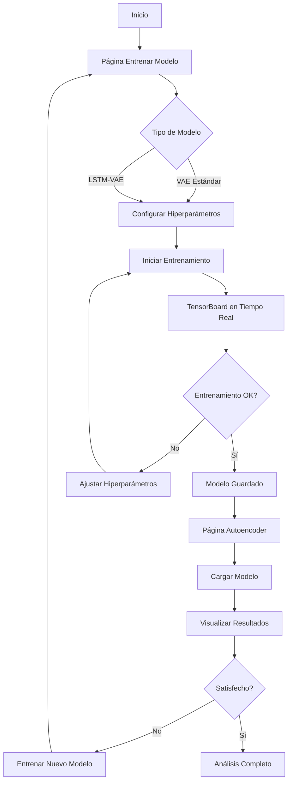

# Guía de Entrenamiento - VAE con TensorBoard en Tiempo Real

## 🎓 Nueva Página de Entrenamiento

Se ha agregado una nueva página dedicada al entrenamiento de modelos VAE con monitoreo en tiempo real.

### Acceso

1. Ejecuta la aplicación: `streamlit run app.py`
2. En el menú lateral, selecciona: **🎓 Entrenar Modelo**

## 🚀 Características

### Entrenamiento Interactivo

- **Selección de Modelo**:
  - 📊 VAE Estándar (mean pooling)
  - 🔬 LSTM-VAE (preserva secuencias)

- **Configuración de Hiperparámetros**:
  - Max Epochs: 10-500 (default: 100)
  - Learning Rate: 0.00001-0.01 (default: 0.001)
  - Batch Size: 2-32 (auto: 16 para VAE, 4 para LSTM-VAE)
  - Early Stopping Patience: 5-50 (default: 15)

### TensorBoard Embebido

Durante el entrenamiento, TensorBoard se ejecuta automáticamente y se muestra en un iframe dentro de la aplicación:

- **Métricas en Tiempo Real**:
  - Loss (train/validation)
  - Accuracy (train/validation)
  - Learning rate
  - KL divergence
  - Reconstruction loss
  - Classification loss

- **Visualizaciones**:
  - Curvas de aprendizaje
  - Histogramas de pesos
  - Distribución de gradientes
  - Gráfico de arquitectura

### Flujo de Trabajo

1. **Seleccionar Tipo de Modelo**
   - Usa VAE estándar para análisis rápido
   - Usa LSTM-VAE para capturar variabilidad intra-participante

2. **Configurar Hiperparámetros**
   - Ajusta según tus necesidades
   - Los valores por defecto son un buen punto de partida

3. **Iniciar Entrenamiento**
   - Click en "🚀 Iniciar Entrenamiento"
   - TensorBoard se inicia automáticamente
   - Monitorea el progreso en tiempo real

4. **Evaluar Resultados**
   - Una vez completado, ve a **🤖 Autoencoder**
   - Carga el modelo recién entrenado
   - Visualiza espacio latente y métricas

## 📊 Comparación de Modelos

### VAE Estándar

**Características**:
- Input: 8 features agregadas (mean pooling)
- Encoder: [64, 32] → Latent 8D
- Decoder: [32, 64] → Output 8
- Classifier: [16] → 2 clases
- Parámetros: ~6,700

**Ventajas**:
- Entrenamiento rápido (~2-5 min)
- Menos memoria
- Interpretable
- Buen baseline

**Desventajas**:
- Pierde variabilidad intra-participante
- Capacidad representacional limitada

### LSTM-VAE

**Características**:
- Input: Secuencias variables (4-36 mediciones)
- Encoder: Bidirectional LSTM (2 capas, hidden=64)
- Latent: 16D (desde hidden state)
- Decoder: Unidirectional LSTM (2 capas, hidden=64)
- Classifier: [32, 16] → 2 clases
- Parámetros: ~205,850

**Ventajas**:
- Preserva variabilidad intra-participante
- Mayor capacidad representacional
- Captura patrones temporales/secuenciales
- Puede revelar información oculta

**Desventajas**:
- Entrenamiento más lento (~5-15 min)
- Más memoria
- Más parámetros → mayor riesgo de overfitting

## 🔧 Solución de Problemas

### TensorBoard No Se Muestra

**Síntoma**: El iframe de TensorBoard aparece vacío

**Soluciones**:
1. Espera 3-5 segundos para que TensorBoard inicie
2. Refresca la página de Streamlit
3. Verifica que el puerto 6006 no esté en uso:
   ```bash
   lsof -i :6006
   pkill -f tensorboard
   ```
4. Inicia TensorBoard manualmente:
   ```bash
   tensorboard --logdir=logs/
   ```

### Error Durante el Entrenamiento

**Síntoma**: El entrenamiento falla con un error

**Soluciones**:
1. Verifica las dependencias:
   ```bash
   pip install -r requirements.txt
   ```

2. Verifica el dataset:
   ```bash
   python -c "import pandas as pd; print(pd.read_csv('data/data.csv').shape)"
   ```

3. Entrena manualmente para ver el error completo:
   ```bash
   # VAE estándar
   python scripts/train_autoencoder.py
   
   # LSTM-VAE
   python scripts/train_autoencoder.py --lstm
   ```

4. Revisa los logs de PyTorch Lightning en `logs/`

### Memoria Insuficiente

**Síntoma**: CUDA out of memory o proceso muerto

**Soluciones**:
1. Reduce el batch size
2. Entrena en CPU (más lento pero funciona):
   - Edita `scripts/train_autoencoder.py`
   - Cambia `accelerator='auto'` a `accelerator='cpu'`
3. Reduce el número de capas LSTM o hidden_dim

## 📈 Interpretación de Métricas

### Loss Total
- **Baja rápidamente**: Modelo aprende bien
- **Plateau temprano**: Aumenta learning rate o complejidad
- **Oscila mucho**: Reduce learning rate o batch size

### Accuracy
- **>70%**: Muy bueno para este dataset
- **50-70%**: Aceptable, features tienen algo de poder discriminativo
- **~50%**: Malo, modelo no aprende (random guessing)

### Val Loss vs Train Loss
- **Similares**: Buen balance, no overfitting
- **Val > Train (moderado)**: Normal, algo de overfitting
- **Val >> Train**: Overfitting severo, reduce complejidad o agrega dropout

### Reconstruction Loss
- **Baja**: Modelo reconstruye bien
- **Alta**: Modelo pierde información
- **Muy baja**: Posible overfitting

### KL Divergence
- **Muy baja**: Espacio latente no está regularizado
- **Muy alta**: Espacio latente muy comprimido, pierde información
- **Balance**: ~0.01-0.1 para VAE, ~0.001-0.01 para LSTM-VAE

## 💡 Tips de Entrenamiento

### Para Mejores Resultados

1. **Prueba ambos modelos**: Compara VAE vs LSTM-VAE
2. **Usa early stopping**: Deja patience=15-20 para evitar overfitting
3. **Monitorea val_acc**: Es la métrica más importante
4. **Experimenta con KL weight**: Afecta estructura del espacio latente
5. **Limpia logs**: Entre entrenamientos para comparaciones limpias

### Ajuste de Hiperparámetros

**Si val_loss no baja**:
- Aumenta learning rate (0.001 → 0.003)
- Aumenta max_epochs (100 → 200)
- Aumenta complejidad del modelo

**Si overfitting (val_loss sube)**:
- Aumenta dropout (0.2 → 0.4)
- Reduce complejidad
- Aumenta KL weight
- Agrega más regularización

**Si entrenamiento muy lento**:
- Aumenta batch size (4 → 8)
- Reduce max_epochs
- Usa VAE estándar en lugar de LSTM

## 🔄 Workflow Completo



## 📚 Referencias

- [TensorBoard Documentation](https://www.tensorflow.org/tensorboard)
- [PyTorch Lightning Logging](https://lightning.ai/docs/pytorch/stable/extensions/logging.html)
- [Streamlit Components](https://docs.streamlit.io/library/components)
- [VAE Tutorial](https://arxiv.org/abs/1312.6114)
- [LSTM Networks](https://colah.github.io/posts/2015-08-Understanding-LSTMs/)

## 🤝 Contribuciones

Si encuentras bugs o tienes sugerencias:
1. Abre un issue en GitHub
2. Describe el problema con capturas de pantalla
3. Incluye logs relevantes de la terminal o TensorBoard
